# 🌐 JobNest - Job Portal Website

##  About
**JobNest** is a job portal connecting **recruiters** and **candidates**.  
Recruiters can **post jobs, manage applications, and track hiring**, while candidates can **search, apply, and manage profiles**.  
The system demonstrates **role-based access, database CRUD, input validation, and error handling** with a modern UI.

---

##  Implementation
- **Roles & Auth:** Recruiter/Candidate roles with secure login via Clerk.  
- **Frontend:** React + Vite + Tailwind + ShadCN UI for responsive dashboards.  
- **Backend & DB:** Supabase (PostgreSQL) with indexing for efficient CRUD operations.  
- **Workflow:**  
  - Recruiters → Post jobs, add company, manage applicants & statuses.  
  - Candidates → Browse/filter jobs, apply with resume, view status, save jobs.  
- **Error Handling:** Prevent duplicate applications, required field checks, alerts.  

---

## Results
- Realistic simulation of recruitment workflow.  
- Demonstrates CRUD, file uploads, notifications, and integration of components.  
- Covers **validation, error handling, and accurate data output**.  

---

##  Screenshots & Workflow

###  1. Modern Homepage
Landing page with a sleek UI, JobNest logo, and login button.  
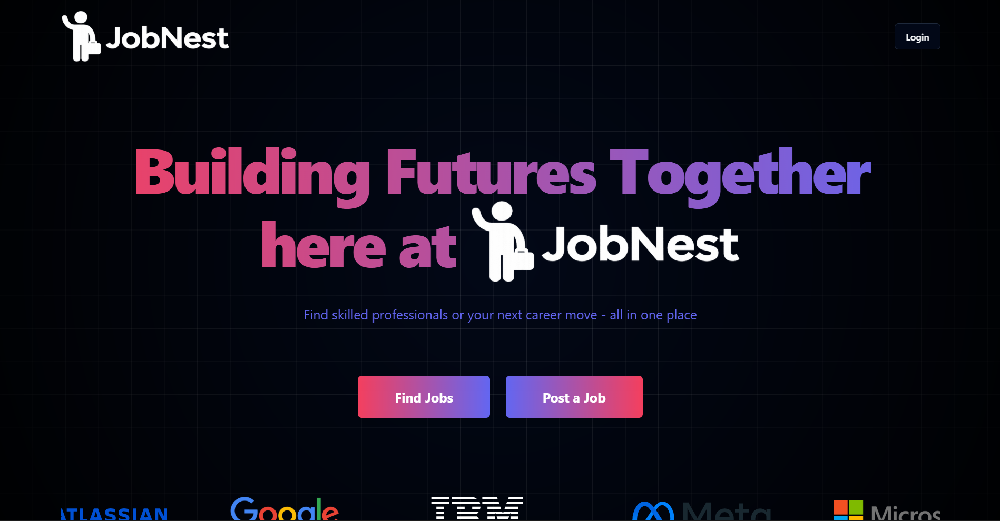

###  2. Company Carousel
Homepage carousel displaying companies hiring on the platform.  


### 3. Footer Section
Homepage footer containing FAQs, support, and useful links.  
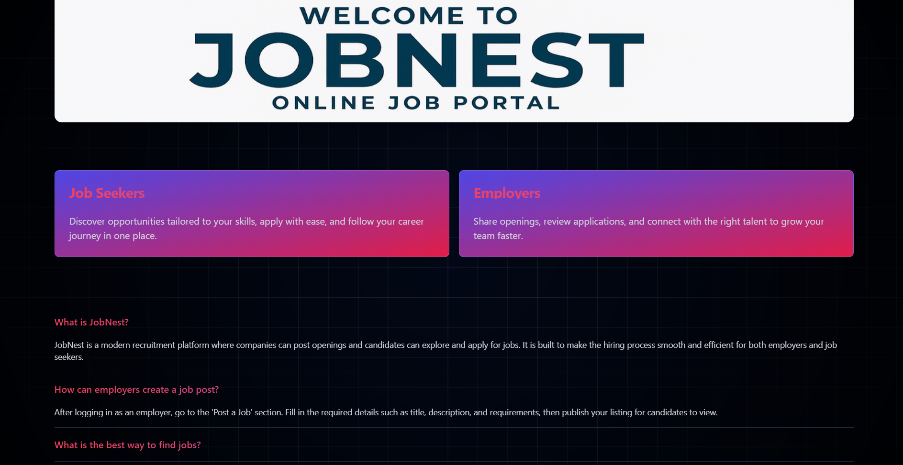

### 4. Authentication
Sign Up & Sign In forms powered by Clerk.  
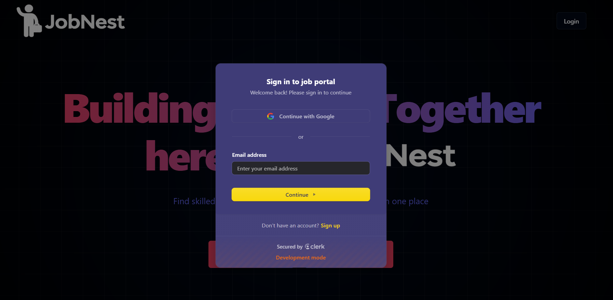

### 5. Role Selection
Choose your role: **Recruiter** or **Candidate**.  
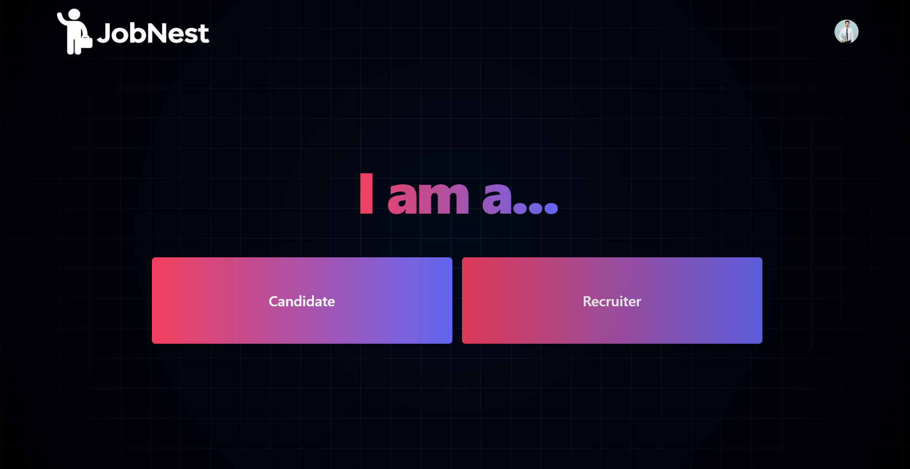

---

###  Recruiter Dashboard

####  6. Post a Job
Recruiters can add job details like title, description, company, requirements, and location.  
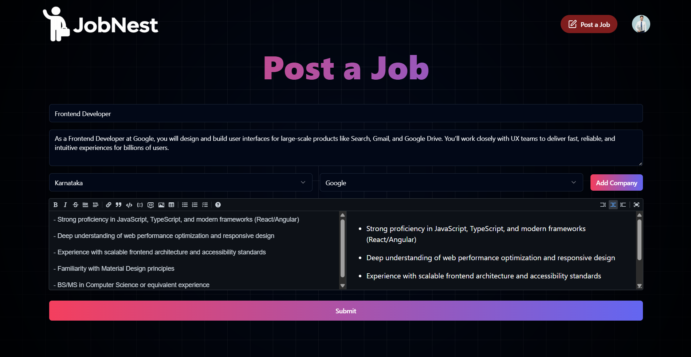

#### 7. Add Company
Recruiters can register their company with **logo** and **name**.  
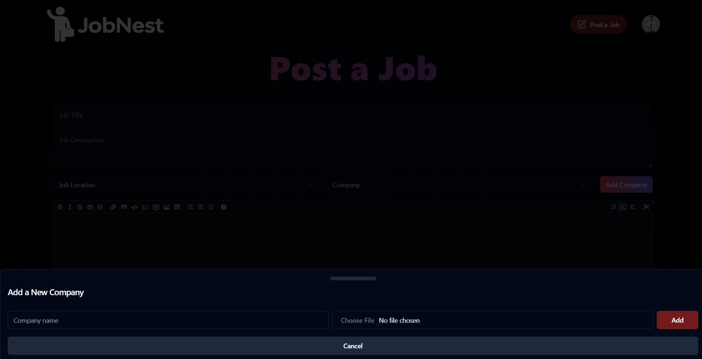

####  8. My Jobs
Recruiters can see all jobs they posted, with the option to delete.  
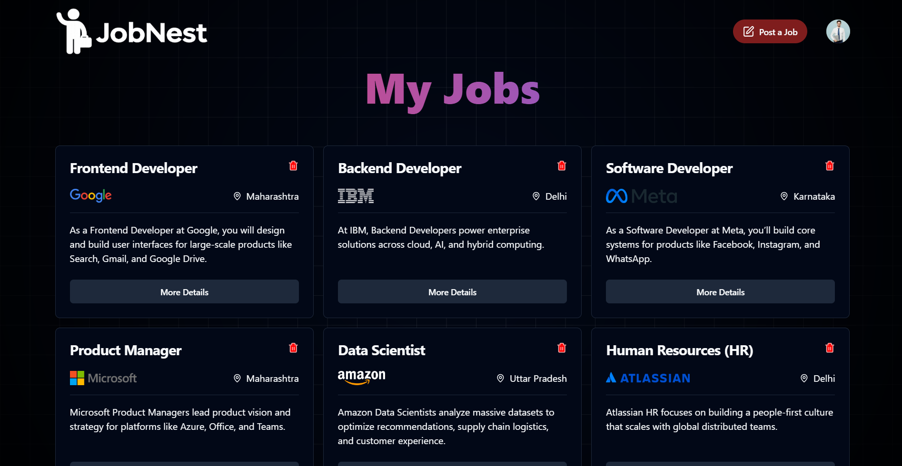

#### 9. Job Details
Detailed job view with **status** (Open/Closed).  
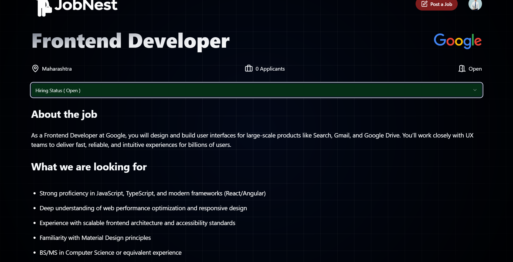

####  10. Applications
Recruiters can view applications, download resumes, and change status (Applied/Hired/Rejected/Interviewing). Candidates get notified automatically.  
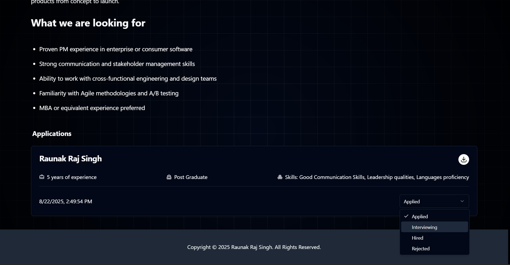

#### 11. Saved Jobs
Recruiters can save/unsave jobs with a heart icon.  
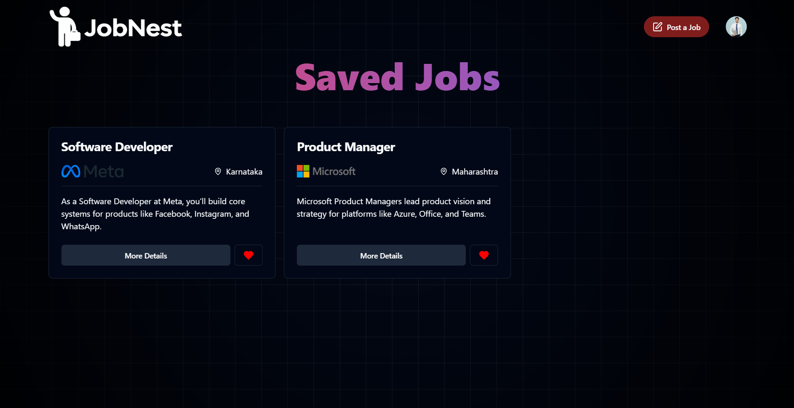

---

###  Candidate Dashboard

####  12. Browse Jobs
Candidates can explore jobs with **filters** by title, company, and location.  
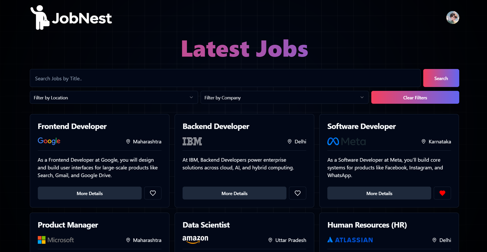

####  13. Job Details
Candidates can view detailed job information and apply.  
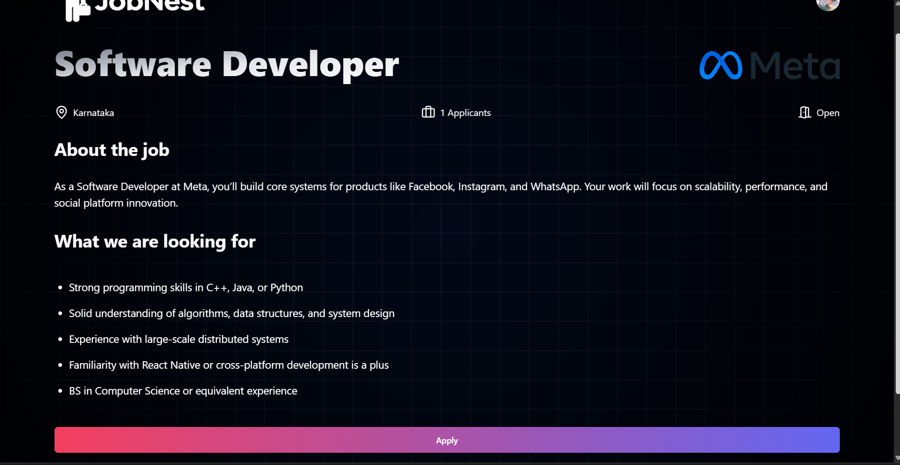

####  14. Apply Form
Application form to enter **experience, skills, education, resume file**, etc.  
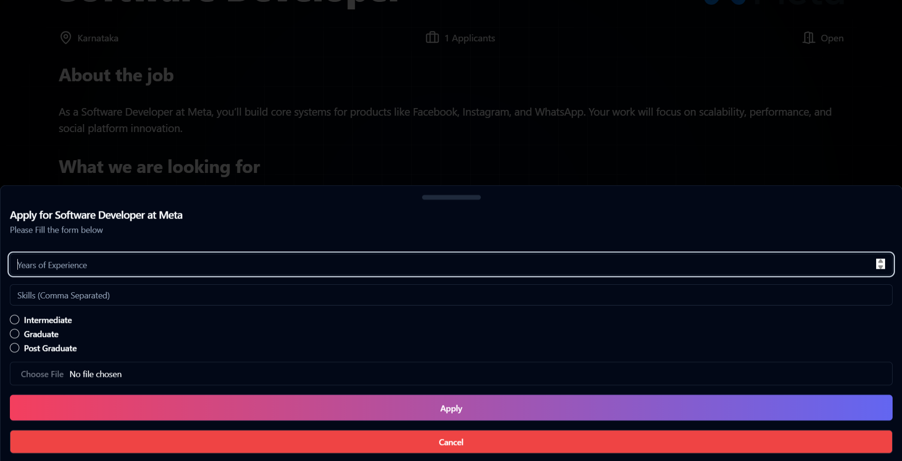

####  15. Apply Restriction
Once applied, candidates **cannot apply twice**.  
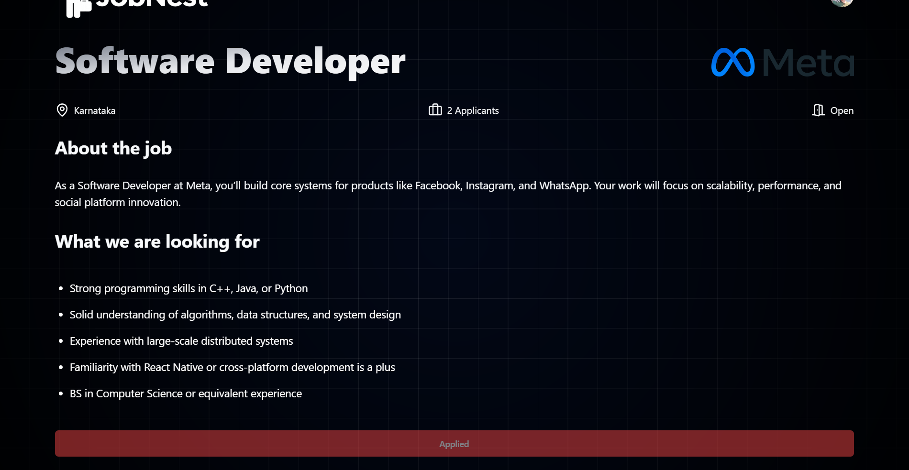

####  16. My Applications
Candidates can see the status of their job applications (Applied/Hired/Rejected/Interviewing).  
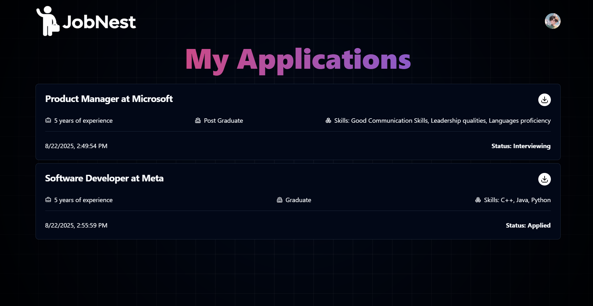

####  17. Saved Jobs
Candidates can save/unsave jobs for later.  
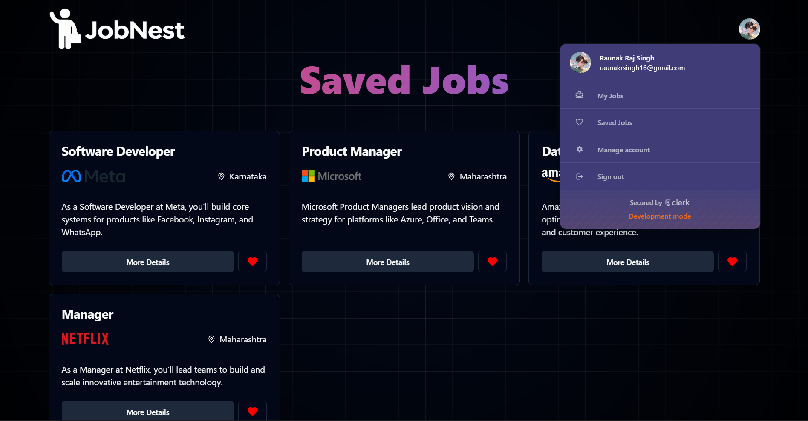

####  18. Profile Management
Candidates can update profile photo, change email, or delete account.  
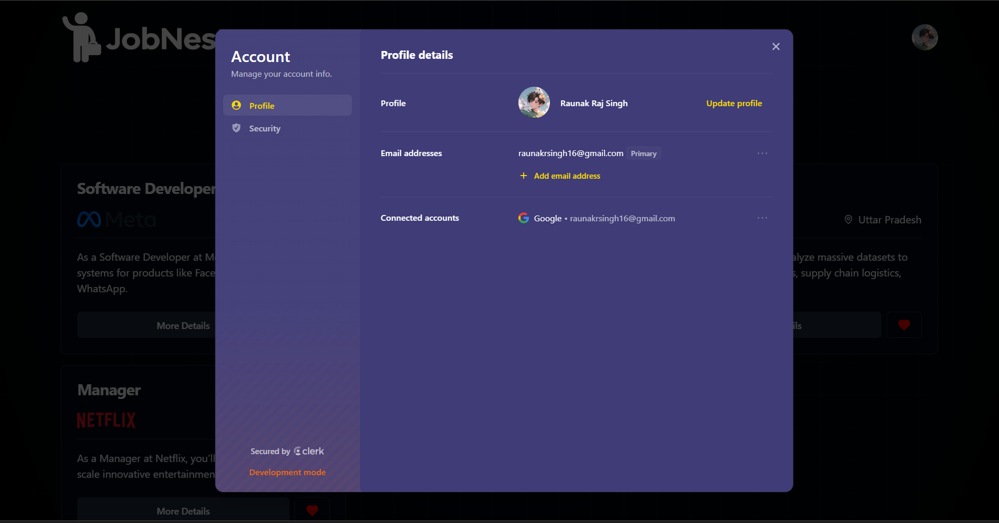

---

##  Tech Stack

**Frontend:** React.js, Vite, Tailwind CSS, ShadCN UI  
**Backend:** Supabase (PostgreSQL)  
**Authentication:** Clerk  
**Database:** PostgreSQL (Supabase)  

---

##  Setup Instructions

1. Clone the repository  
   ```bash
   git clone https://github.com/YOUR_USERNAME/jobnest.git
   cd jobnest
2. Install dependencies
    ```bash
   npm install
3. Start the development server
   ```bash
   npm run dev
4. Create and configure your Supabase database
5. Add environment variables in a .env file:
   ```bash
   VITE_SUPABASE_URL=your_supabase_url
   VITE_SUPABASE_ANON_KEY=your_supabase_anon_key
   VITE_CLERK_PUBLISHABLE_KEY=your_clerk_publishable_key

## Contact

For any queries, reach out:
📧 raunakrsingh16@gmail.com

❤️ Built with Love by Raunak
